現代孩子的成長環境充滿了 3C 螢幕的誘惑與精緻飲食的挑戰。許多家長常面臨「孩子手機拿走就生氣」、「晚上不肯睡、早上叫不醒」、「近視度數飆升」或是「吃太多零食長不高」的困擾。

規律的作息與健康的生活習慣，是孩子學習與大腦發育的基石。本文整理了數位管理、生活作息、飲食視力保健與性教育等六大面向的親職圖卡，為您提供實用的健康生活指南。

---

## 📌 一、數位管理：如何與 3C 螢幕和平共處

數位時代無法完全禁止孩子使用 3C，但我們可以建立健康的規則，避免網路成癮。

### 1. 螢幕看太多的影響與使用時間分配
螢幕看太多會影響大腦發育、專注力與睡眠。1-12 歲的孩子需要依年齡嚴格分配螢幕與睡眠的黃金比例。

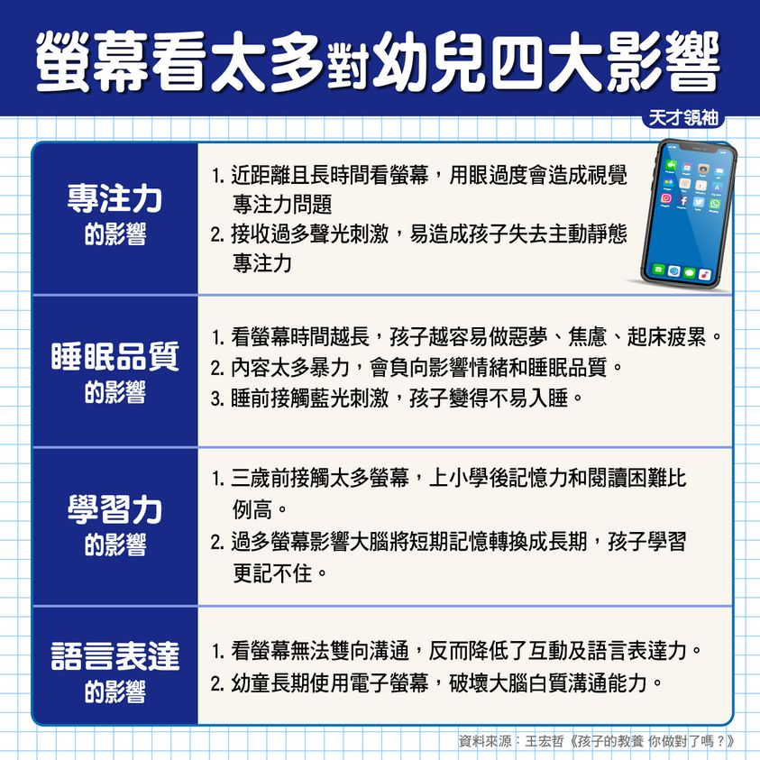
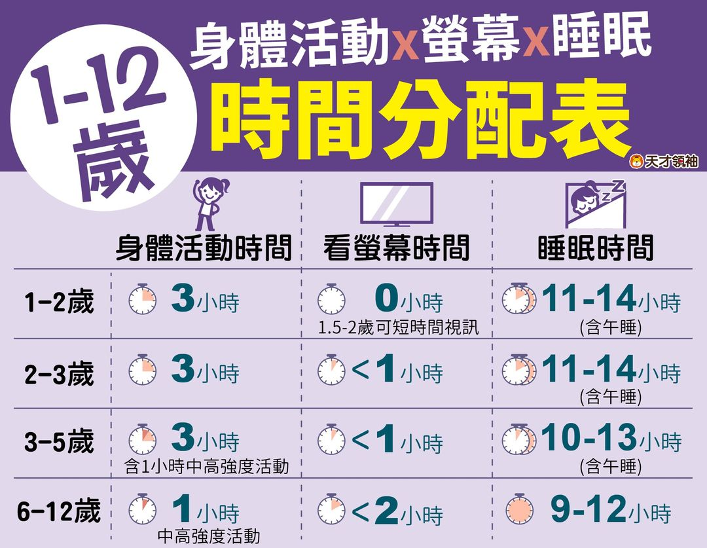

### 2. 手機使用六階段與數位家規
引導孩子使用手機應循序漸進，並與孩子共同制定「手機使用家規」，明確規範使用時間與場所（例如：吃飯、睡前不看手機）。同時留意孩子是否已出現「網路成癮」的警訊。

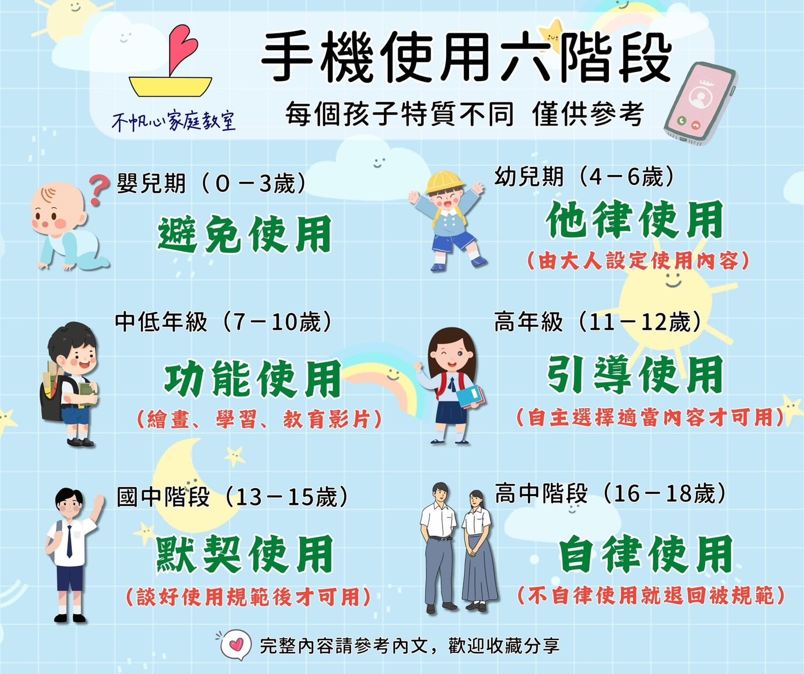
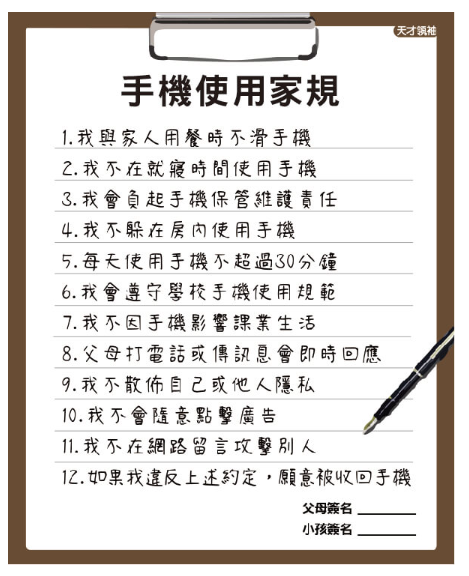
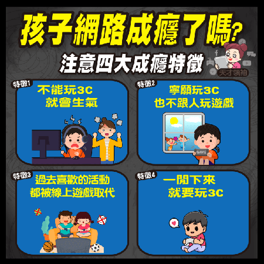

---

## 📌 二、睡眠與早餐：開啟一天的學習力

睡眠不足與營養不均衡，是孩子白天精神不濟、學習效率低下的主因。

### 1. 上學沒精神？6 招幫助大腦開機
如果孩子早上總是昏昏沉沉，可以透過規律起床時間、適度伸展、照陽光等方式，幫助大腦快速開機。

### 2. 吃錯早餐影響一整天
早餐是活化大腦的關鍵。吃太多精緻糖或高油食物（如鐵板麵、含糖飲料），會導致血糖波動過大，反而讓孩子在課堂上容易分心、昏昏欲睡。

---

## 📌 三、飲食與發育：健康長高的秘訣

孩子的發育只有一次，均衡的營養是長高與發育的關鍵。

### 1. 想長高？避開五大 NG 食物
除了補充鈣質，更要避免攝取過多的碳酸飲料、油炸食物和含糖零食，這些食物會抑制生長激素的分泌。

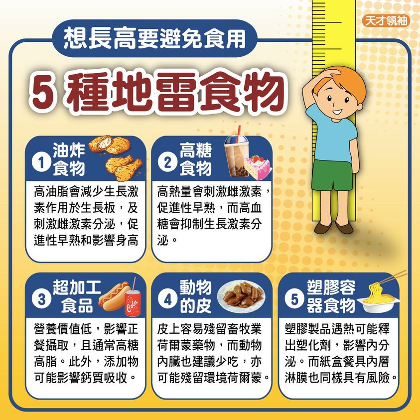

---

## 📌 四、視力保健：保護靈魂之窗

隨著線上學習增加，近視防範已成為家長的重中之重。

### 1. 打造好視力與破解近視迷思
「戴眼鏡會讓近視變深？」是常見的錯誤觀念。保護視力應落實「戶外運動 2 小時」與「用眼 30 分鐘休息 10 分鐘」的原則，並定期進行視力檢查。

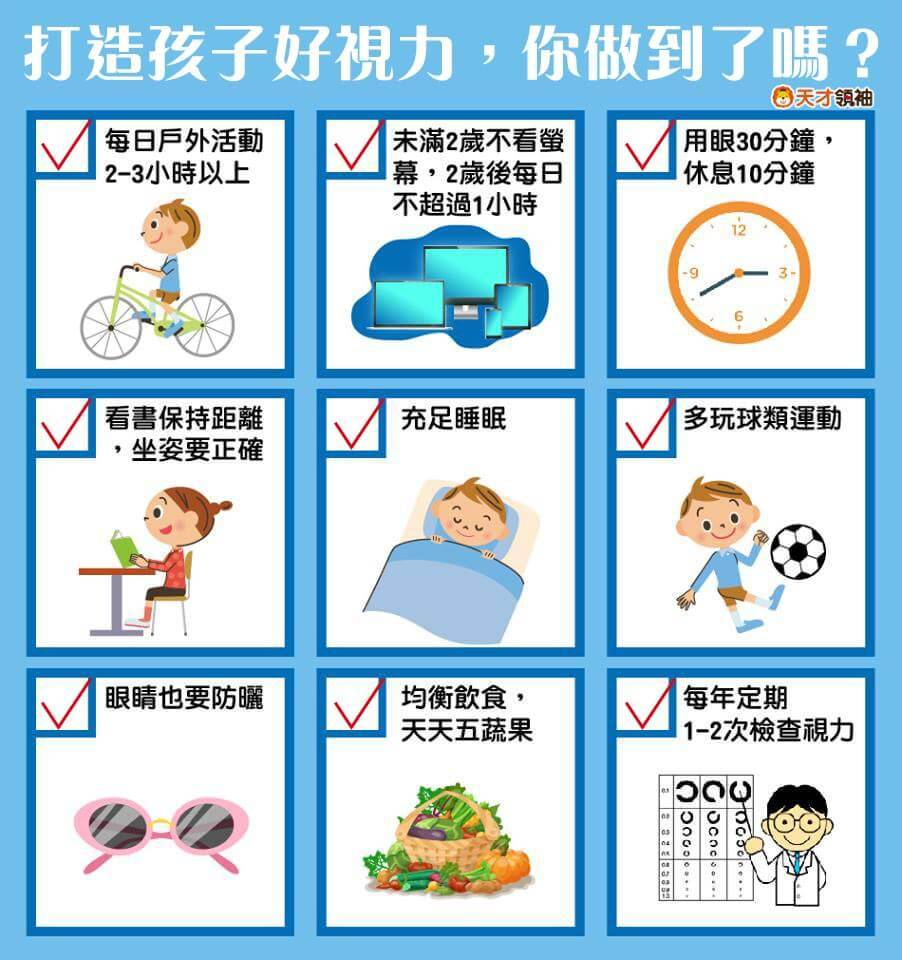
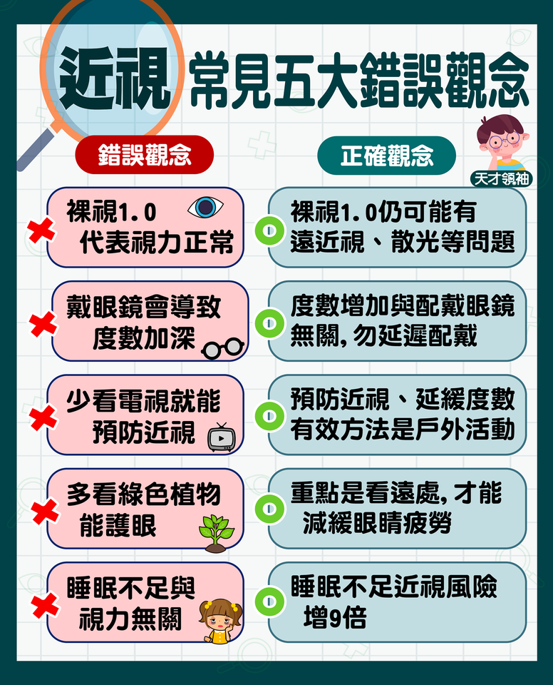

---

## 📌 五、運動與遊戲：大腦發育的助推器

運動能刺激多巴胺與血清素分泌，不僅能強健身體，更能提升學習效率。

### 1. 運動的好處與必玩經典遊戲
每種運動對孩子大腦與身體的刺激各有不同。此外，傳統的經典遊戲（如躲貓貓、跳格子）能訓練孩子的感統與人際互動，是數位遊戲無法取代的。

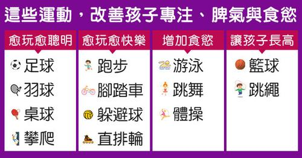
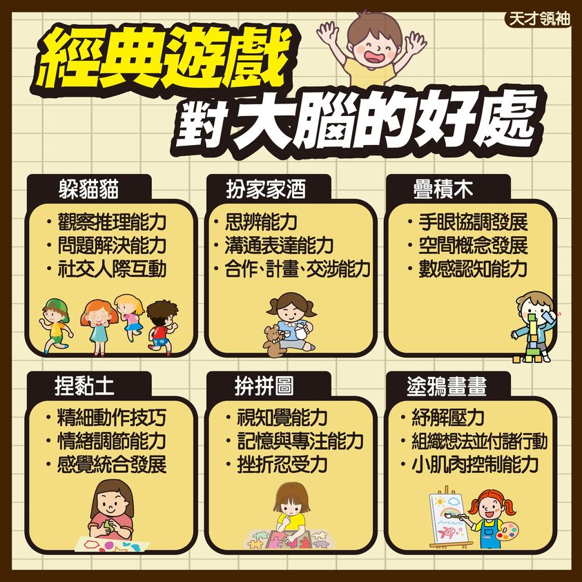

---

## 📌 六、性教育、陪伴與性別教育

日常生活中，還有一些敏感但極為重要的生活課題需要家長正確引導。

### 1. 性教育：孩子磨蹭性器官的應對原則
當幼兒出現磨蹭性器官的行為時，爸媽請掌握「3 不 3 要」原則：不責罵、不貼標籤、不刻意張揚；要同理、要轉移注意力、要給予安全感。

### 2. 陪伴與性別引導
研究指出，父母陪伴的時間長短，深切影響孩子的人格發展與心理健康。另外，教導男孩與女孩在生理與心理上的差異與尊重，也是家庭教育重要的一環。

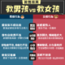

> [!TIP]
> **健康生活悄悄話：**
> 健康的生活習慣是給孩子一輩子最好的禮物。從今晚開始，關掉電視與手機，陪孩子早點入睡，並準備一頓營養的早餐，這就是最簡單也最強大的親職教育！
