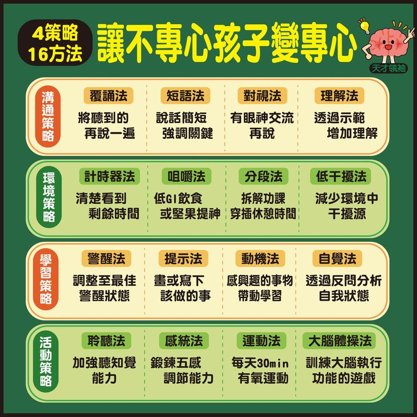
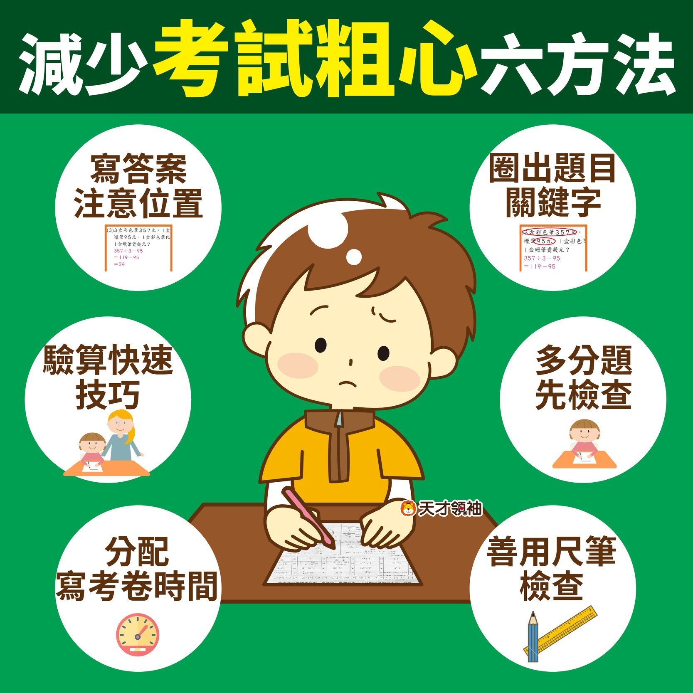
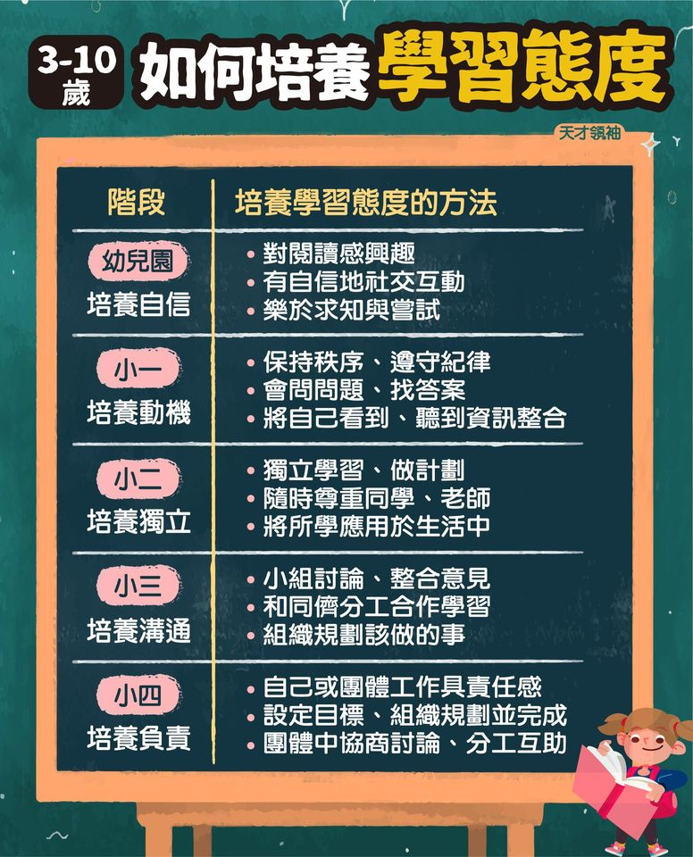
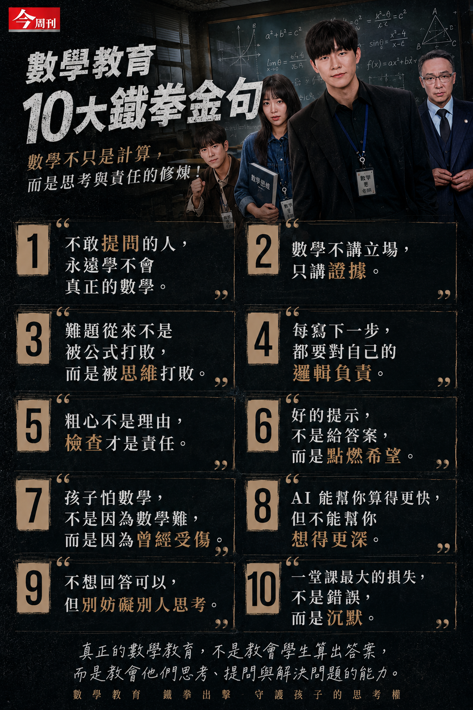
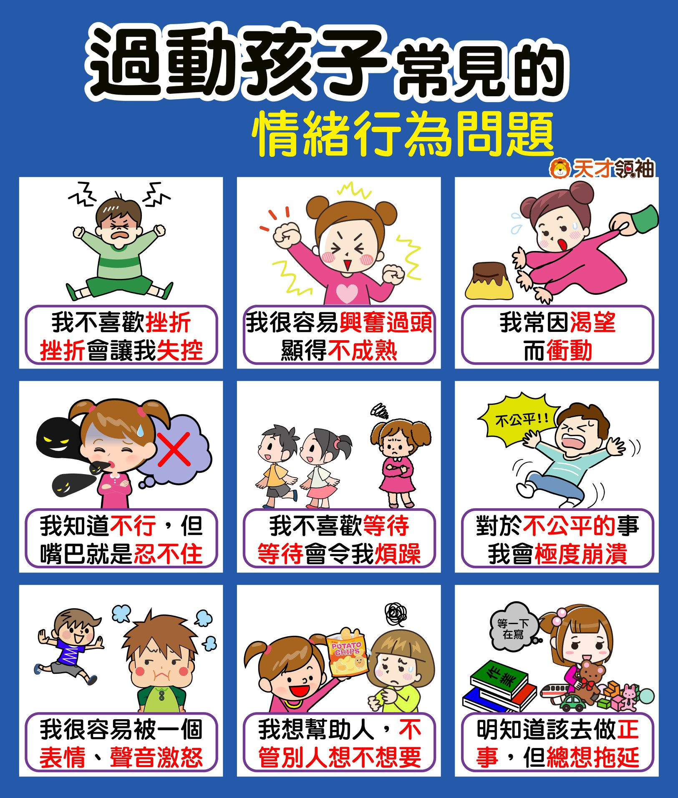

「快去寫功課！」、「怎麼又在發呆？」是許多家庭每天上演的對話。孩子寫作業拖拉、容易分心，背後的原因往往不是他們「故意偷懶」，而是大腦的執行功能、時間觀念或學習工具尚未準備好。

本文將學習力與專注力細分為五大核心層面，並搭配豐富的專業圖卡，帶您一步步陪孩子建立高效學習力。

---

## 📌 一、建立時間觀念與解決拖拉

孩子沒有「時間感」，就容易出現拖延、散漫的毛病。如何建立時間概念，是戒除拖拉的第一步。

### 1. 0到10歲時間觀念建立
不同年齡的孩子對時間的理解大不相同。家長應根據孩子的發展階段，由淺入深地引導他們認識時間，例如用視覺化的沙漏或計時器來感受時間的流逝。

### 2. 解決寫作業慢吞吞與拖拉毛病
寫作業慢、拖拉、散漫，往往是因為孩子不知道如何開始、或是缺乏動機。了解背後的關鍵原因，並透過 6 招具體方法引導，能讓孩子逐漸拿回時間的主導權。

---

## 📌 二、提升專注力與「靜得下」的訓練

「分心」是學習的大敵。我們要先找出干擾源，再透過日常活動提升大腦的專注力。

### 1. 找出分心的原因與對策
環境中的雜音、生理上的疲憊或教材的難度都會影響專注。專家提供的方法，能有效把分心的孩子拉回軌道。

### 2. 聽知覺的訓練：有聽沒有到？
有些孩子不是故意不聽，而是「聽覺注意力和記憶力」較弱。透過 6 個聽認知改善法，能改善孩子「左耳進、右耳出」的習慣。

### 3. 讓孩子靜下來的日常活動
靜坐並非唯一的靜心方式。日常中可以透過 24 個動靜結合的活動，幫助孩子宣洩多餘精力，進而安定心神。

---

## 📌 三、陪讀、寫作業與考試技巧

陪伴功課需要方法，過多的盯梢反而會讓孩子失去責任感。

### 1. 陪伴功課與面對考不好
陪伴孩子功課的目的是引導他們「學會如何學習」，而非充當糾錯機。面對成績不理想，應與孩子一同探討「背後原因」，而非一味責備。

### 2. 減少粗心與培養好態度
許多孩子考不好是因為「粗心」。這與工作記憶和檢查習慣有關，可以透過結構化的步驟來改善。同時，3到10歲是建立良好學習態度的黃金期。

---

## 📌 四、讀寫能力的根本培養

讀寫是一切學習的基石。如果孩子在讀寫的生理機能上遇到阻礙，學習就會倍加吃力。

### 1. 握筆姿勢與肌肉訓練
寫字太累、字跡混亂，通常是因為手部「小肌肉」力量不足或握筆姿勢不對。透過適當的感統活動，刺激肌肉發展，才能輕鬆寫好字。

### 2. 閱讀能力的階段發展
從親子共讀到自主閱讀，了解孩子不同年齡應具備的閱讀指標，並用正確的方法啟發他們的閱讀興趣。

---

## 📌 五、理解學習障礙與特殊挑戰

當孩子展現出極大的學習困難或特殊的行為特徵時，我們需要更多的專業同理與特教思維。

### 1. 感統失調、學習障礙與過動 (ADHD)
「感統失調」的孩子可能對環境異常敏感；「學習障礙」的孩子在特定科目（如閱讀或書寫）遭遇生理性困難；而「過動」孩子則需要更多動態活動和結構化生活。了解這些特徵，才能給予孩子適切的協助。

### 2. 聰明但愛挑戰的孩子
對於資質聰敏、反應快，但特別愛挑戰常規的孩子，教導他們尊重、同理以及學習面對失敗，是不可或缺的六件事。

> [!NOTE]
> **給家長的一句話：**
> 學習力不是一天造成的，它與孩子的生理成熟度、安全感和家庭氛圍息息相關。當我們放下焦慮，從最簡單的時間管理與手部肌肉訓練開始，孩子就會慢慢找到屬於自己的學習節奏。
