進入學校是孩子社會化的重要里程碑。無論是剛從幼兒園升上小學的「幼小銜接」，還是寒暑假結束後的「開學收心」，對孩子（甚至是家長）來說，都是一項充滿挑戰的適應過程。

本文整理了幼小銜接必備能力、分離焦慮應對、以及書包挑選與整理等實用圖卡，陪您的孩子自信踏入校園。

---

## 📌 一、幼小銜接與開學前準備

從幼兒園到小學，作息與學習方式有很大轉變。提前做好準備，能大幅降低孩子的不適應。

### 1. 小一入學必備能力清單
小一新生除了基本的認知學習，更需要具備生活自理、人際互動和專注力等綜合能力。比對這份清單，提早陪孩子練習不足的項目。

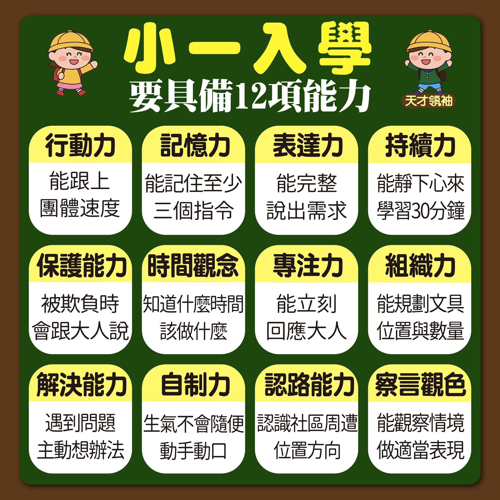
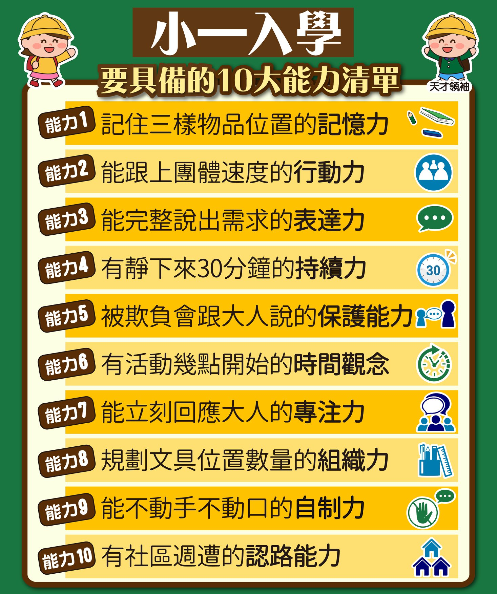

### 2. 幼小銜接爸媽該做的五件事與開學心態
幼小銜接期間，父母的角色是「陪伴與支持」。透過建立規律作息、熟悉校園環境、以及調整 12 種正向心態，能讓孩子對小學生活充滿期待。

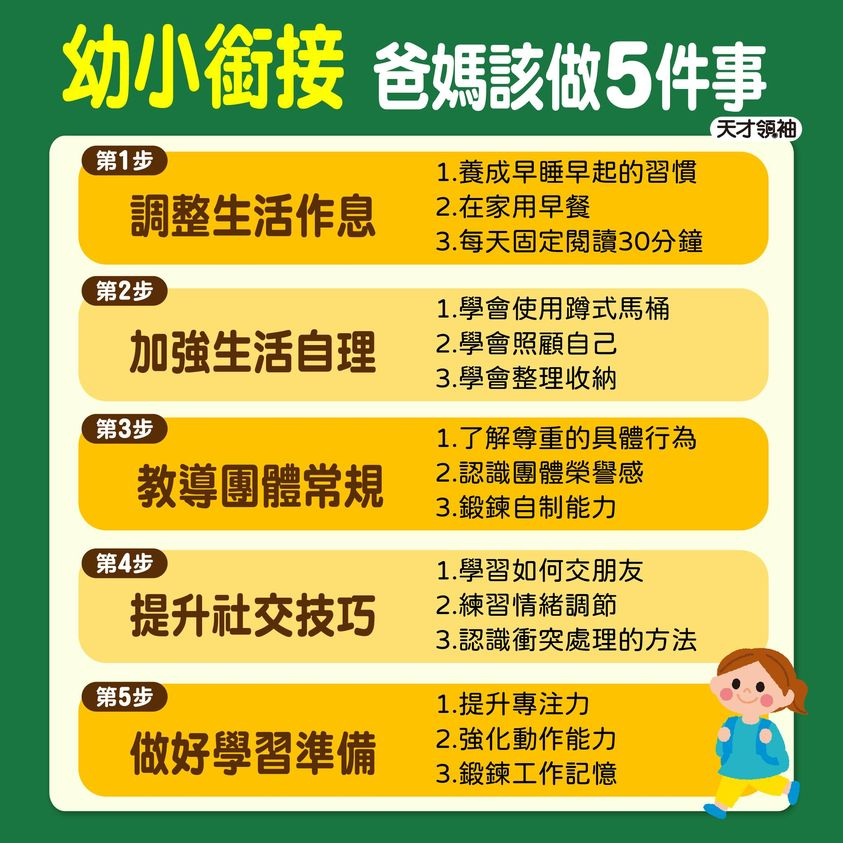
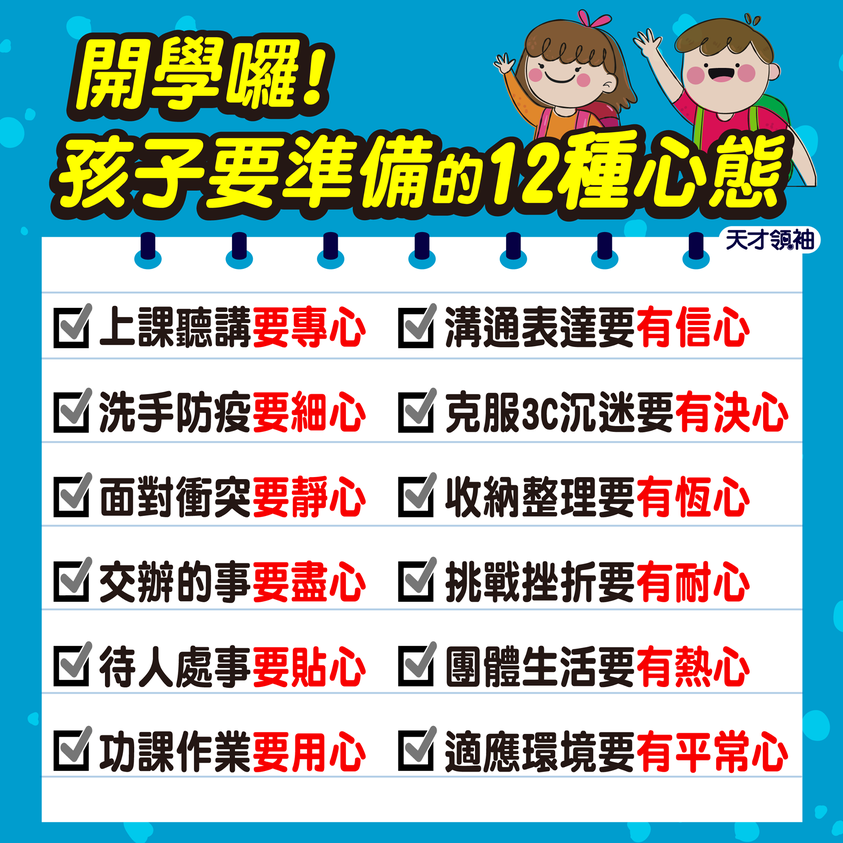

---

## 📌 二、克服上學不適應與分離焦慮

開學前幾天，孩子常會出現肚子痛、哭鬧、不想上學的情況。這時父母的安定感是最大的關鍵。

### 1. 減少分離焦慮的具體對策
面對分離焦慮，父母要「做對 5 招」，例如保持溫和堅定的告別、守時接送。避免偷偷溜走或流露出比孩子更焦慮的神情。

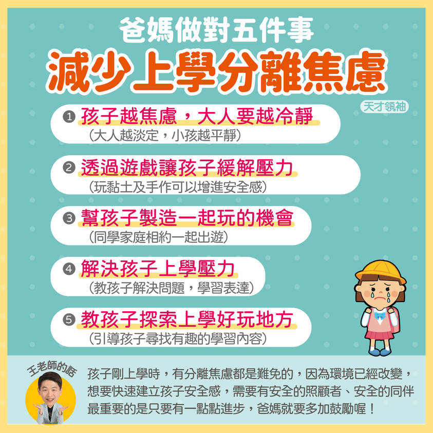
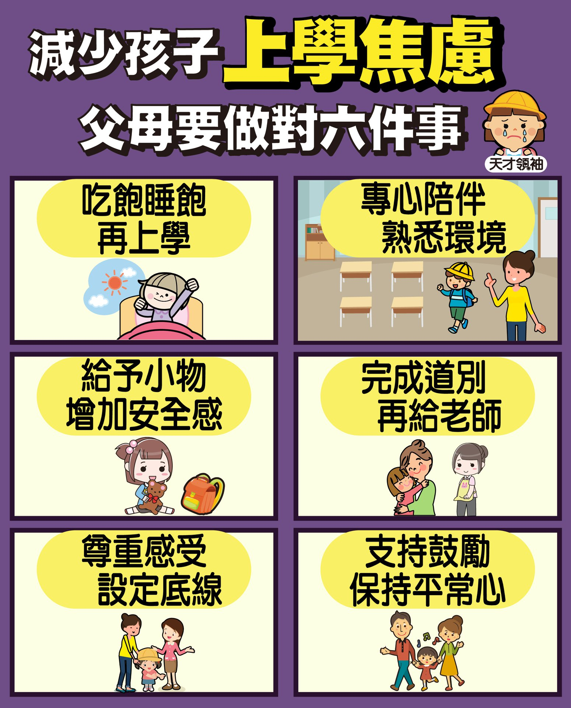
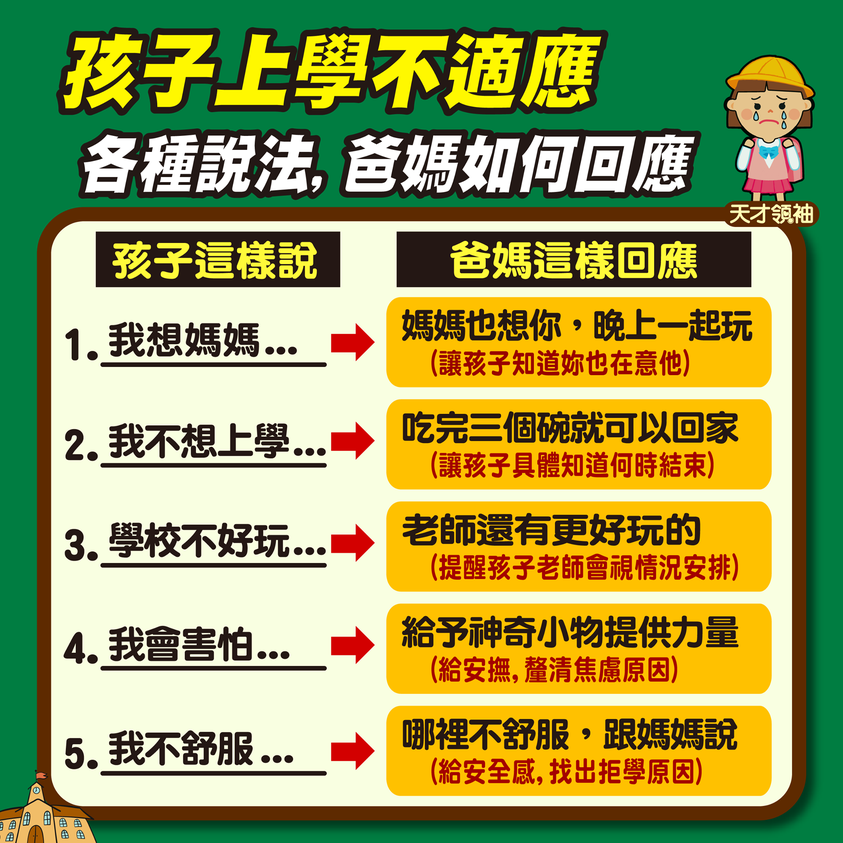

### 2. 快速收心大法
假期結束前，提早一至兩週漸進式調整作息，並安排一些靜態的準備活動，能幫助大腦順暢開機，迎接新學期。

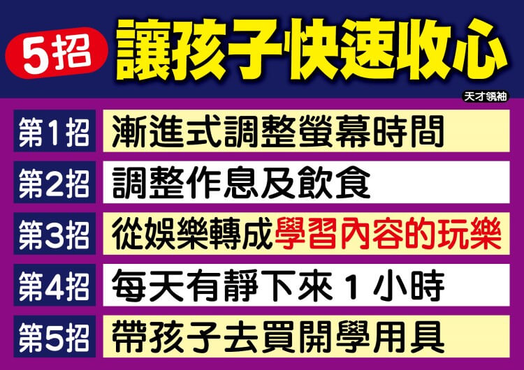

---

## 📌 三、自理能力訓練：挑選書包與整理收納

「書包像垃圾桶」是很多孩子的寫照。整理書包不僅是生活自理，更是邏輯思考與責任感的體現。

### 1. 挑選書包 8 重點
一個合適的書包能保護孩子的脊椎發育。挑選時要注意重量、寬肩帶、護脊設計與收納隔層。

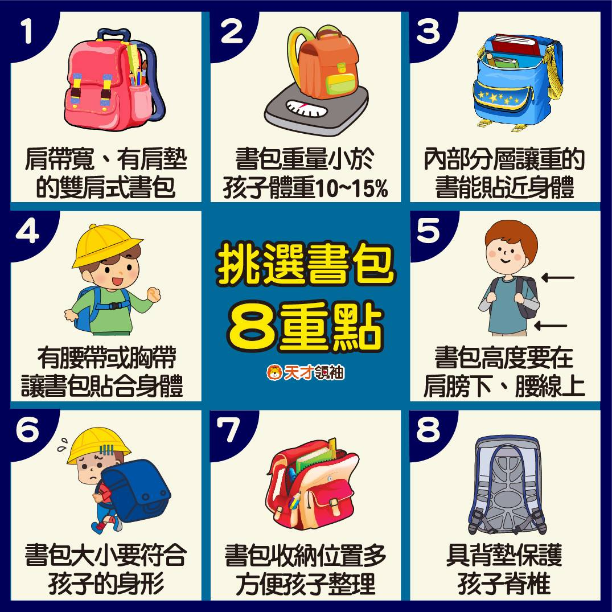

### 2. 教孩子整理與收納書包
不要幫孩子整理！請陪著他們用「6 遊戲」學會分類書本、鉛筆盒與雜物，養成每天睡前檢查課表、自己收拾書包的習慣。

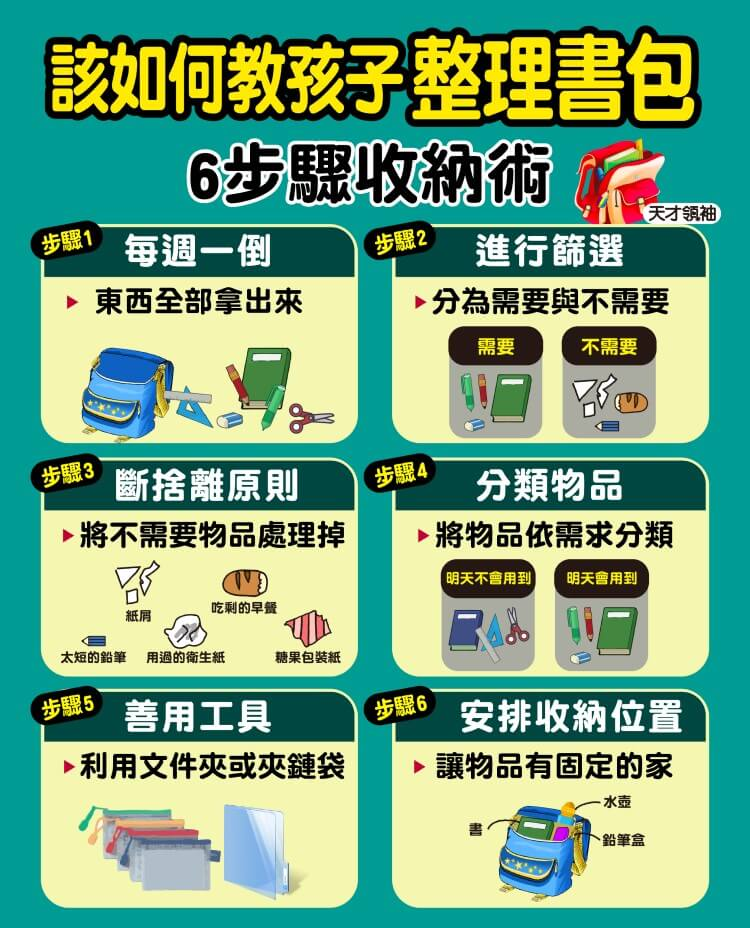
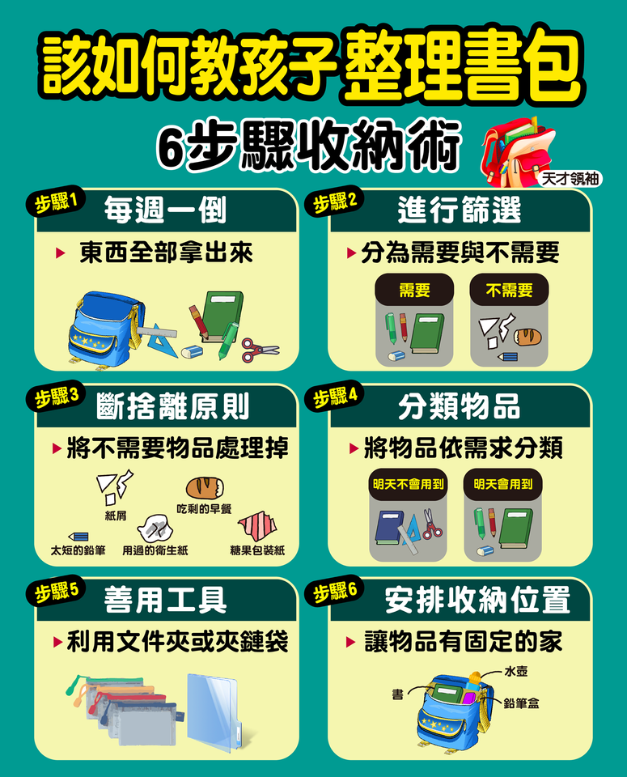

---

## 📌 四、校園人際：班上有特殊生時的相處模式

在學校裡，孩子會遇到各式各樣的同學，包括特殊教育需求的孩子。

### 1. 特殊生相處引導
教導孩子同理心、不要投以異樣眼光，並學會安全的互動與相處模式。這不僅能幫助特殊生融入班級，更能培養孩子善良與包容的優良品格。

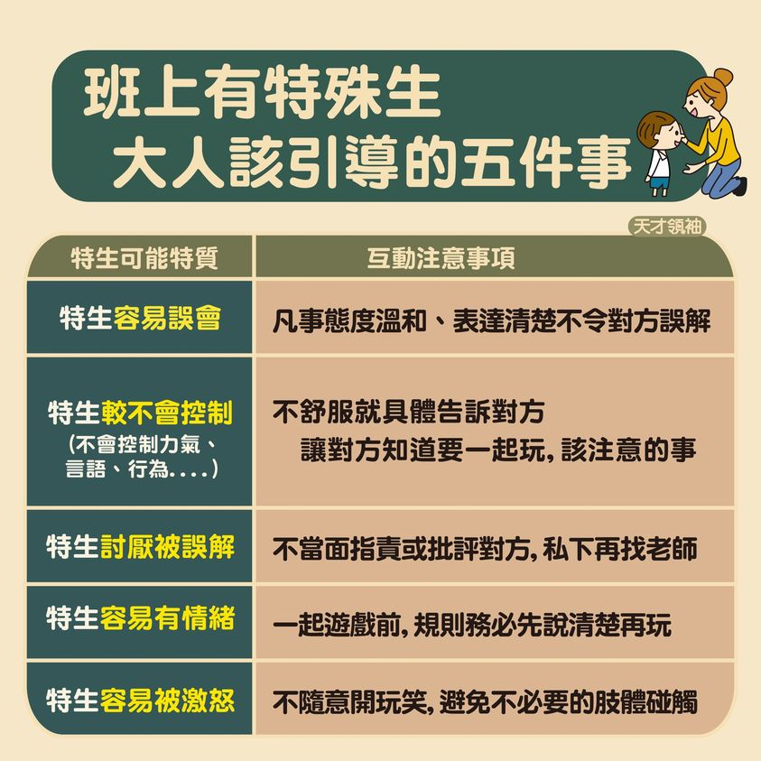

> [!IMPORTANT]
> **給家長的開學提醒：**
> 開學初期的混亂與情緒是正常的適應過程，給孩子一點時間，多用鼓勵代替催促。當家長展現出對學校的信任，孩子就能更快安定下來，享受豐富的校園生活！
