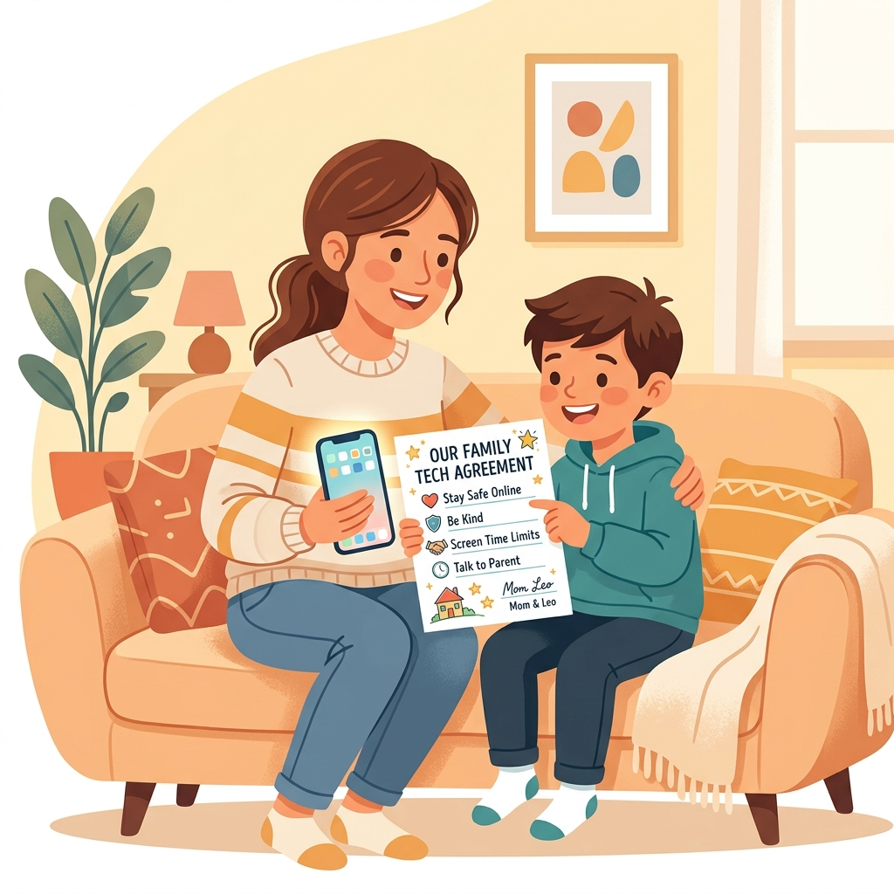
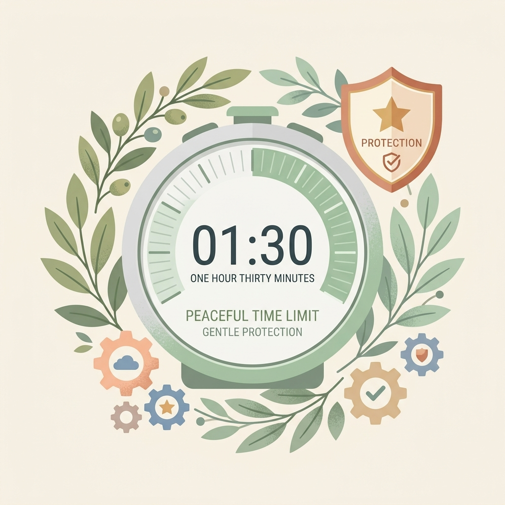

# 建立健康數位界線：家長手機監管 App 實用指南

當孩子開始使用第一支手機時，許多家長常面臨兩難：不給手機怕孩子落伍、聯絡不上；給了手機又擔心遊戲成癮、瀏覽不當內容。設定手機監管並非要窺探隱私，而是給剛接觸網路世界的小學生一道「安全護欄」。

---

## 📌 一、觀念篇：防沉迷，先「溝通」再「監管」

給家長的三個核心觀念：
1. **技術是輔助，溝通是核心：** 安裝任何監管 App 前，務必與孩子說明原因，讓孩子知道這是出於保護，而不是控制。
2. **身教重於言教：** 家長自己也應注意不在餐桌或睡前過度使用手機，與孩子一同遵守數位健康規則。
3. **循序漸進的信任：** 國小中低年級可以嚴格管控時間；到了高年級，應主動放寬部分限制，與孩子討論合理的時間規劃。

---

## 📌 二、比較篇：主流原生監管 App 該選哪一個？

我們不推薦付費的第三方軟體。因為手機系統（Android 與 iOS）安全性極高，第三方 App 經常會因為權限限制而失效或閃退。相反，系統內建的免費工具——**Google Family Link** 與 **Apple 螢幕使用時間**是最穩定且功能強大的選擇。

### 👉 挑選決策點：
* 孩子使用 **Android (安卓)** 手機 ➔ 選擇 **Google Family Link**
* 孩子使用 **iPhone / iPad** ➔ 選擇 **Apple 螢幕使用時間 (Screen Time)**

### 💡 核心功能快速對照表：

| 管理維度 | Google Family Link (Android 孩子) | Apple 螢幕使用時間 (iPhone 孩子) |
| :--- | :--- | :--- |
| **費用** | 完全免費 | 完全免費 (系統內建) |
| **家長端設備限制** | 不限（家長用 iPhone 或 Android 皆可） | 僅限 Apple 設備（家長必須用 iPhone/iPad/Mac） |
| **螢幕時間限制** | **極強**：每日限時、就寢鎖定、一鍵立即鎖定 | **良好**：停用時間、App 限制、剩餘時間通知 |
| **App 審核下載** | 孩子下載任何 App 均需家長端點擊「同意」 | 配合「家人共享」可開啟「購買前詢問」 |
| **定位追蹤** | **內建**：可看見即時 GPS 位置、設定安全區域通知 | 需另使用「尋找」App 分享位置 |
| **內容過濾** | 過濾 Chrome、Google 搜尋、YouTube 限制模式 | 系統級過濾不當網站、限制 App 內購買與隱私修改 |

---

## 📌 三、教學篇：手把手設定指南

### 1. Google Family Link (管理 Android 孩子端)
家長可以在自己的 iPhone 或 Android 手機下載「Google Family Link」應用程式進行遠端控制。

*   **第一階段：帳號建立與配對**
    在設定新手機時，為孩子建立一個小於 13 歲的兒童 Google 帳戶。在家長手機下載 Family Link App 並登入。在孩子手機登入該兒童帳戶，依據指示掃描 QR Code 完成家長綁定。
*   **第二階段：核心限時與 App 審核**
    在 Family Link 中設定「限額」（每天可玩時間，如 1 小時）與「就寢時間」（到時間自動鎖定）。在「內容限制」中設定所有新下載 App 必須經過家長審核批准。
*   **第三階段：即時定位與遠端鎖定**
    點選「位置」開啟「查看孩子的定位」並設定安全區域（到校/到家通知）。在晚餐或寫功課時間，家長可一鍵點擊「立即鎖定」暫停孩子使用。

---

### 2. Apple 螢幕使用時間 (管理 iPhone 孩子端)
當家長與孩子都是 Apple 使用者時，可以利用內建的「家人共享」進行設定。

*   **第一階段：加入家人共享與啟用**
    家長在 iPhone「設定」> [您的名字] >「家人共享」中建立兒童 Apple ID，並在孩子手機登入。隨後在家長手機開啟「螢幕使用時間」，選擇孩子名字並設定專屬「螢幕使用時間密碼」。
*   **第二階段：設定停用時間與 App 限制**
    設定「停用時間」（睡前強制休眠）與「App 限制」（針對遊戲或娛樂設定每日上限）。在「內容與隱私權限制」中勾選「限制成人網站」，系統會自動過濾。
*   **第三階段：防制不當消費與定位**
    在「iTunes 與 App Store 購買」中，將「App 內購買」設為「不允許」，並禁止刪除 App。在家人共享中開啟「位置分享」，便可使用 iPhone 內建的「尋找」App 查看即時位置。

---

## 📌 四、問答篇：家長常見問題與破解防範

*   **Q1：孩子會利用「調整系統時間」來解除限時，該怎麼辦？**
    *   **【防範策略】：** 在 iOS 中，啟用「螢幕使用時間密碼」後孩子無法修改時間。在 Android 中，若修改系統時間，Family Link 會因為與網路時間不對稱而自動鎖定。請家長保護好監管密碼，切勿讓孩子得知。
*   **Q2：孩子利用 YouTube 網頁版或第三方瀏覽器來避開 App 限制？**
    *   **【防範策略】：** 只鎖 YouTube App 是不夠的。您必須在內容限制中，將 Chrome 或 Safari 瀏覽器也納入限時，或者在「網頁內容限制」中過濾不當網站，且必須開啟「下載審核」以防止孩子下載其他沒有限制的第三方瀏覽器。
*   **Q3：孩子快滿 13 歲了，Family Link 會失效嗎？**
    *   **【法規知識】：** 根據 Google 規範，滿 13 歲時孩子會收到郵件允許他們自主管理。家長應在孩子 11-12 歲時，漸漸減少技術管控的強度，改以民主討論。若滿 13 歲後仍有需要，可經由雙方同意重新手動開啟 Family Link 監管。

---

## 📌 五、契約篇：第一支手機使用約定範本

與其用冰冷的 App 強制鎖定，不如與孩子在開機的第一天就共同簽訂「手機使用合約」。這份合約旨在建立規範，讓孩子明白：擁有手機是一項「責任與權利」，而非理所當然。

> ### 📄 親子手機使用承諾書
>
> 我們同意，手機是為了方便聯絡與學習而準備的工具。為了健康與安全，我們共同遵守以下約定：
>
> **一、使用時間約定：**
> 1. 每天可使用的總時間為：週一至週五 _____ 分鐘，假日 _____ 分鐘。
> 2. 晚上 _____ 點後，手機自動進入就寢鎖定，並統一放置在客廳充電，不帶入臥室。
> 3. 吃飯時間、寫功課時間不看手機。
>
> **二、安全與隱私約定：**
> 1. 下載 any App（不論是否免費）都需要經過爸爸媽媽的同意與審核。
> 2. 不在網路上透露自己的真名、電話、學校、地址或個人照片給不認識的人。
> 3. 不隨便點擊來路不明的連結或中獎通知。
>
> **三、友善數位約定：**
> 1. 在網路上打字說話，要和在學校一樣有禮貌，不說傷人的話、不參與網路霸凌。
> 2. 如果在網路上看到讓人不舒服、害怕的內容或收到奇怪的訊息，我會立刻告訴爸爸媽媽，我不用擔心被罵。
>
> **四、違反約定的處理：**
> 若有違反上述約定，同意將手機交由家長保管 _____ 天。
>
> 孩子簽名：_______________       家長簽名：_______________
> 日期：民國 _____ 年 _____ 月 _____ 日
