# AI 學習大冒險：家長與孩子的 AI 啟蒙與共讀指南

隨著人工智慧的快速發展，AI 已經融入我們與孩子的日常生活中。身為家長，我們該如何引導孩子接觸 AI，又該如何與孩子一起在 AI 的世界中安全、有趣地「大冒險」呢？

本篇親職資源整理了 **《AI 學習大冒險》** 完整 12 頁精美圖卡，以圖文並茂、生活化的方式，幫助家長與孩子共同建立 AI 基礎素養。

---

## 📌 一、如何使用這份資源？

1. **親子共讀：** 家長可以與孩子一起觀看下方的圖卡，討論生活中有哪些地方已經用到了 AI（例如：手機人臉解鎖、YouTube 推薦影片、語音助理等）。
2. **啟發探索：** 鼓勵孩子發問，思考 AI 能幫我們解決什麼問題，又有哪些事情是 AI 做不到、需要人類智慧的。
3. **建立數位界線：** 透過圖卡引導孩子了解在使用 AI 工具時，應注意哪些個人隱私與資訊安全。

---

## 📌 二、手冊圖卡預覽 (共 12 頁)

本站已將圖卡進行響應式優化，在手機、平板與電腦上皆能舒適閱讀。點擊任一圖片可放大瀏覽。

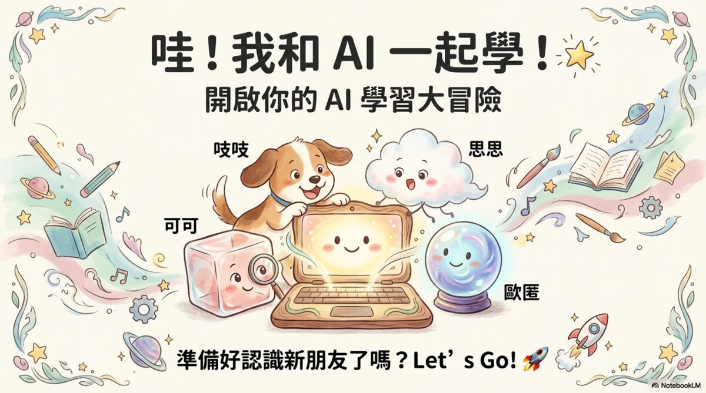
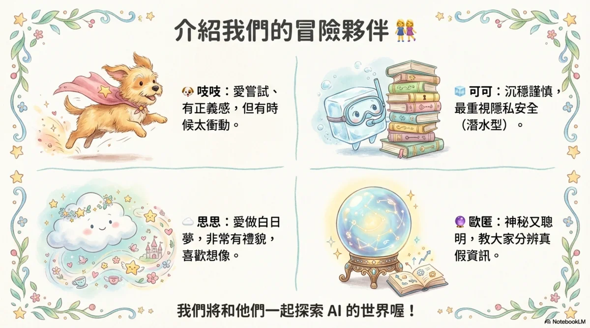
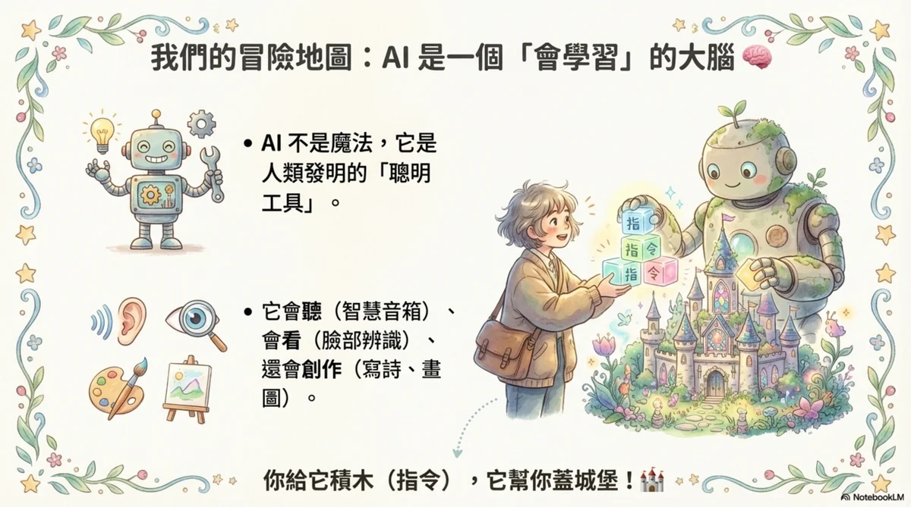
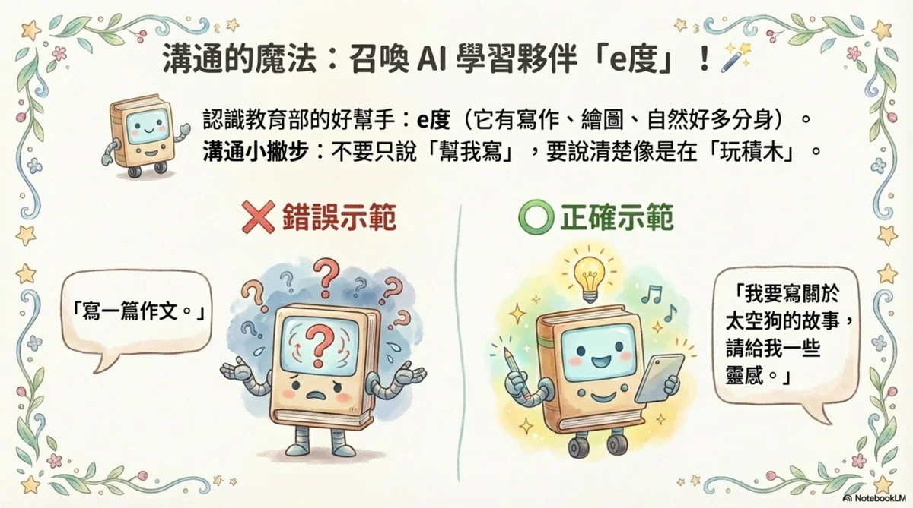
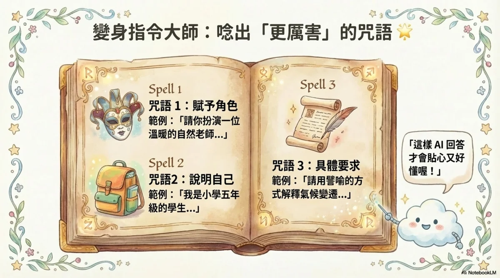
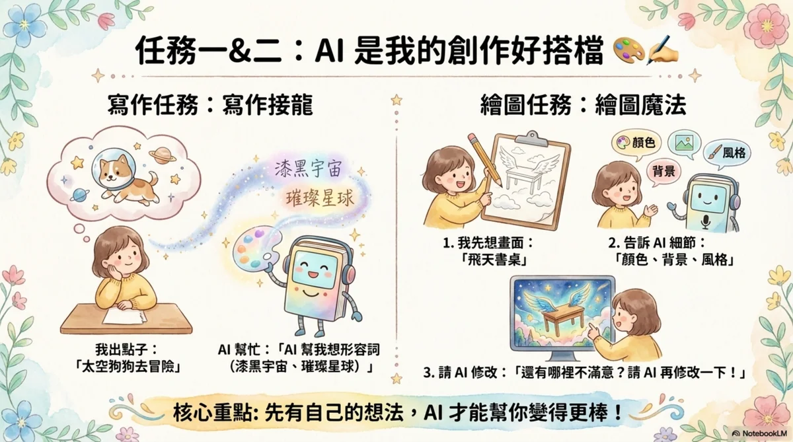
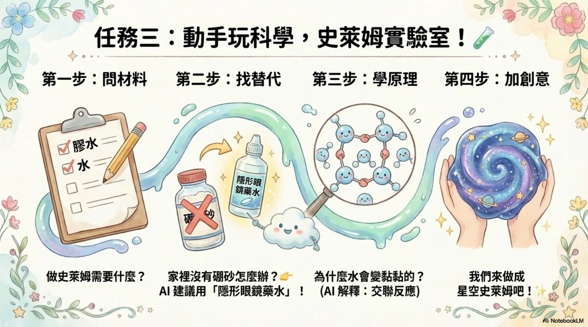
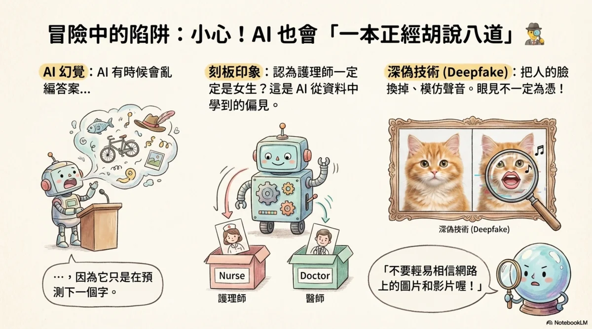
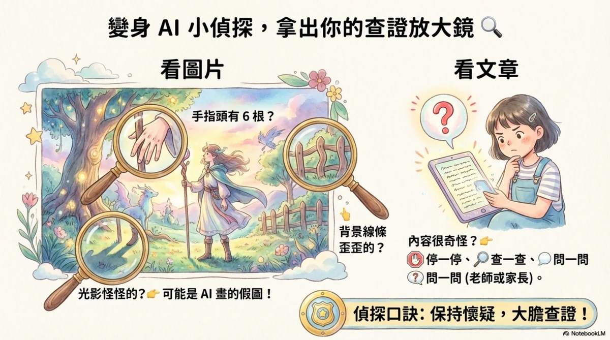
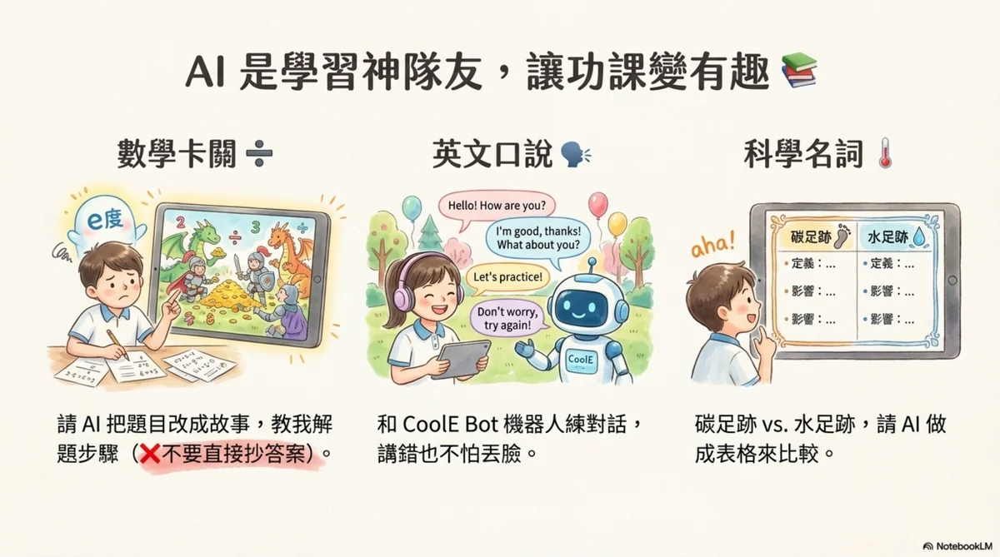
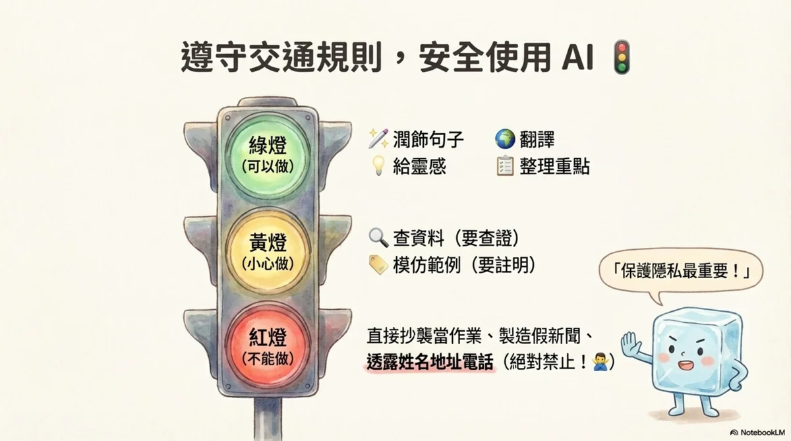
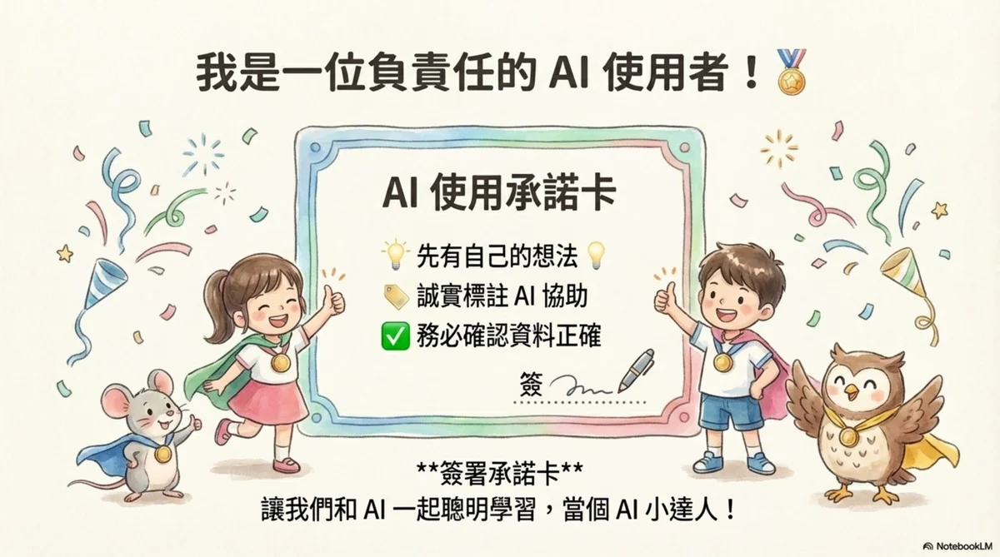

---

## 📌 三、完整版手冊 PDF 下載

如果您需要列印實體紙本，或是保存高品質的原始手冊檔案，歡迎點擊下方按鈕下載完整版 PDF 檔案：

  <a href="../assets/files/AI_學習大冒險.pdf" target="_blank" class="btn btn-primary" style="font-size: 16px; padding: 12px 28px; box-shadow: var(--shadow-sm);">📥 下載《AI 學習大冒險》完整 PDF 手冊</a>

