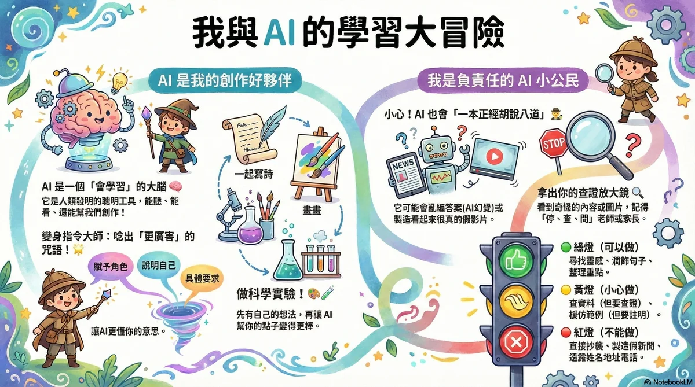

# AI 時代的教養心法：如何陪伴孩子安全探索 AI 世界

生成式 AI 工具（如 ChatGPT、繪圖 AI 等）已經成為孩子學習與創作的新夥伴。身為家長，除了擔心孩子過度依賴或接觸不當資訊外，更重要的是建立健康的互動觀念。

本文整理了精美的教養指引圖卡，從**心態建立**、**安全界線**與**親子對話**三個面向，陪伴家長一同面對 AI 時代的教養挑戰。

---

## 📌 一、核心教養觀念

1. **正向面對，理解先行：** 避免一味禁止孩子使用 AI。與其防堵，不如與孩子一起探索 AI 能做什麼，引導孩子發現 AI 的便利與局限。
2. **思辨能力（Critical Thinking）的養成：** 告訴孩子 AI 生成的內容不一定百分之百正確，需要保持懷疑、進行查證，這正是培養獨立思考的絕佳機會。
3. **科技的溫度與身教：** 在享受科技便利的同時，家長應多與孩子進行實體互動，安排戶外活動，並以身教示範健康的手機與電腦使用習慣。

---

## 📌 二、日常教養圖卡指引

本站已將圖卡進行響應式設計優化，無論使用手機、平板或桌上型電腦，均能完美適配顯示。

---

## 📌 三、親子溝通的三個問題

家長可以在日常生活中，透過以下三個簡單的問題，與孩子聊聊 AI：

*   **「你最近用了什麼 AI 工具？它幫你解決了什麼問題？」** ➔ 建立開放的分享氛圍，避免孩子因為害怕被責備而隱瞞使用。
*   **「你覺得 AI 給你的答案，裡面有沒有寫錯的地方？你是怎麼發現的？」** ➔ 引導孩子進行事實查核，培養數位思辨力。
*   **「如果我們要用 AI 來寫故事或畫畫，怎樣才算是有自己的創意，而不是完全抄襲？」** ➔ 討論數位倫理與著作權概念，讓孩子學會尊重原創。
