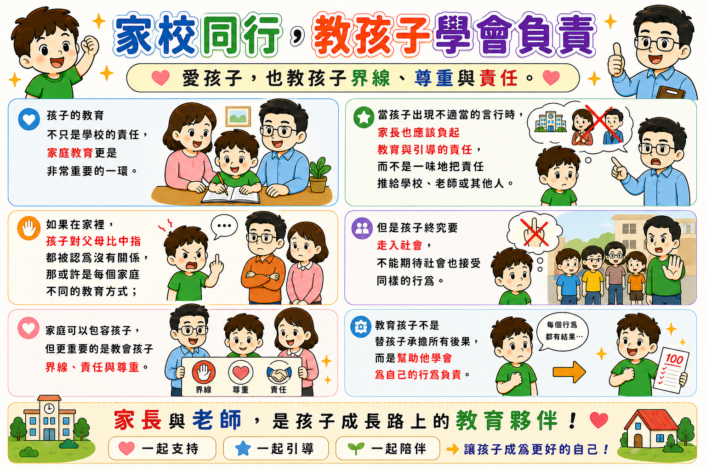

# 家校同行，教孩子學會負責

❤️ **愛孩子，也教孩子界線、尊重與責任。** ❤️

  
  

    <a href="家校同行_教孩子學會負責.png" download class="btn-download">⬇️ 下載圖檔原圖</a>
  

---

### 💡 核心溝通理念與教育指引

1. **家庭教育與學校教育並重**
   - 孩子的教育不只是學校的責任，家庭教育更是非常重要的一環。
   - 當孩子出現不適當的言行時，家長也應該負起教育與引導的責任，而不是一味把責任推給學校、老師或其他個人。

2. **建立界線、責任與尊重**
   - 如果在家裡孩子對父母不尊重的言行被認為沒關係，或許是家庭不同的教育方式；
   - 但是孩子終究要走向社會，不能期待社會也接受同樣的行為。
   - 家庭可以包容孩子，但更重要的是教會孩子界線、責任與尊重。

3. **為自己的行為負責**
   - 教育孩子不是替孩子承擔所有後果，而是幫助他學會為自己的行為負責。
   - 家長與老師是孩子成長路上的教育夥伴！

---

🤝 **家長與老師，是孩子成長路上的教育夥伴！**  
❤️ 一起支持 🌟 一起引導 🌱 一起陪伴 ➡️ 讓孩子成為更好的自己！
