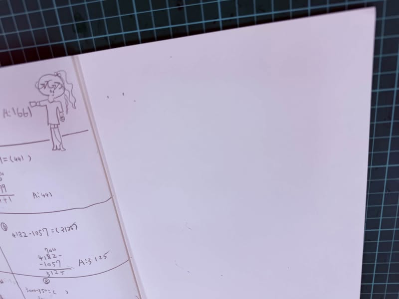

# 📏✨【從 1 公分的距離，看見觀察的魔法！】

`#說數學` `#教學日誌` `#屏科實中國小部`

🌟 謝謝扶堂主任的好書及共備主持人分享

---

    

「孩子們，不拿尺，憑你的感覺……1 公分到底有多長？」

今天在數學課上，我跟孩子們玩了一個小挑戰。
我讓大家在白紙上點出兩個點，試著憑直覺畫出一條「剛好 1 公分」的線段。

拿起尺一量，教室裡立刻傳出各種驚呼聲：
「哇！我畫得剛剛好欸！」
「太長了啦！我畫到快 2 公分了！」
「原來 1 公分比我想像中的還要短許多！」

---

> 🔗 原貼文連結：[敬修老師 Facebook 貼文](https://www.facebook.com/jing.siou.lin/posts/pfbid0GXqxTaQpwFpw1UL2XnnNkP4Z4yBkhuqbLUYdjo4RZ2L4o9baug26GJ7xy32aZ8eTl)
